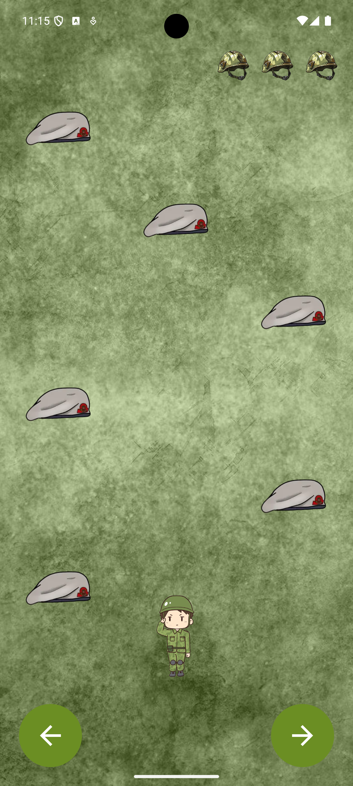
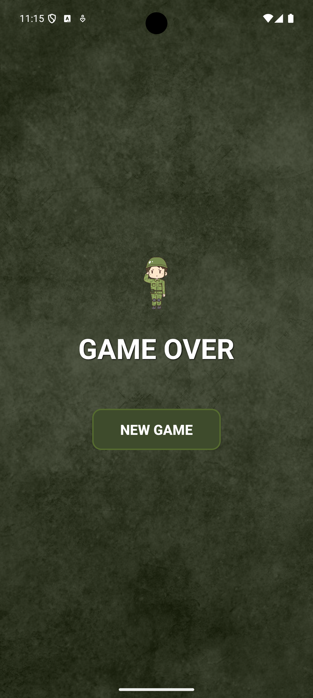

# 🏃‍♂️ Soldier Run

**Android Development Course Project (2025) - Afeka College**

A fast-paced survival game where the soldier must dodge falling berets by moving between lanes.

## 📱 Screenshots

| Game Play | Game Over |
|:---------:|:---------:|
|  |  |

## 🚀 Key Features
* **Gameplay:** Dodge obstacles across 3 dynamic lanes.
* **Feedback:** Visual and haptic (vibration) feedback on collision.
* **Difficulty:** "Meteor shower" effect with increasing intensity.
* **Score System:** Live tracking and high-score display.

## 🛠 Technical Highlights
* **Language:** Kotlin
* **Architecture:** Logic separation using `GameManager` (Logic) vs `MainActivity` (UI).
* **Design Patterns:** Singleton implemented in `SignalManager`.
* **UI Components:** ViewBinding, Custom Animations, and Intent/Bundle for data passing.

---
**Created by:** Aviv Shemesh
📧 Aviv.Shemesh1@s.afeka.ac.il
